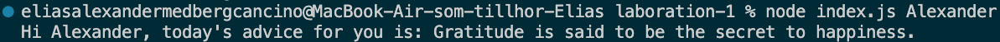

# Reflektion: Laboration 1 – Fortsätt programmera

<!--
    Komplettera filen och lämna in den tillsammans med din MR.
-->

## 1. Att fortsätta programmera

*Vilka kunskaper och färdigheter från tidigare kurser bygger du vidare på i den här uppgiften? Vad var mest utmanande? Vad vill du utveckla vidare i din programmering framöver?*

Svar: JavaScript och Node kändes förstås igen sedan tidigare kurser, liksom att arbeta i terminalen. Den absolut största utmaningen var git- och remote-hanteringen, att koppla ihop lokala repon med GitHub och GitLab, hantera SSH-nycklar och lösa åtkomstproblem tog betydligt mer tid än själva kodskrivandet.

## 2. Arbetsflödet

*Hur kändes det att arbeta med Git och använda kursens plattformar?*

Svar: Jag stötte på en hel del praktiska hinder under vägen: SSH-nycklar, skillnaden mellan HTTPS och SSH för git, att behöva ansluta till eduVPN hemifrån, samt personal access tokens och ActionHub för att skapa mina GitLab-resurser. Det kändes lite omständligt i stunden, men var en nyttig och lärorik läxa.

*Varför valde du GitLab eller GitHub för din kod? Vad vägde du in — till exempel integritet, att bygga en publik portfolio, eller vana? Om GitHub — länk till ditt repo:*

Svar: Jag valde att versionshantera koden på GitHub, bland annat för att det blir obligatoriskt från och med Laboration 2 och för att bygga vidare på min publika portfolio. Länk till mitt repo: https://github.com/EACORTHO777/laboration-1

## 3. Bedömning och att dela publikt

*Uppgiften bedöms inte på kodens stil eller kvalitet, bara på en komplett inlämning. Påverkade det hur du arbetade? Och hur kändes det att posta din skärmdump/video publikt i Zulip, utan möjlighet att göra det privat?*

Svar: Inga som helst problem med det, jag tycker snarare att det är kul att kunna hämta inspiration från hur andra kursdeltagare löst uppgiften i Zulip.

## 4. Ditt program

*Vilket programmeringsspråk valde du, och varför just det?*

Svar: Jag valde JavaScript/Node.js eftersom det är det språk jag känner mig mest bekväm med.

*Vad gjorde du för att göra välkomstmeddelandet till något mer än bara `"Hej " + namn`?*

Svar: Programmet hämtar ett slumpat råd från det öppna API:et api.adviceslip.com och väver in det i välkomstmeddelandet.

## 5. AI-samarbete

*Samarbetade du med någon AI-assistent (t.ex. ChatGPT, GitHub Copilot, Claude) — som en kollega snarare än bara ett verktyg? Beskriv kort hur, och ge gärna ett exempel på en prompt som gav ett bra resultat.*

Svar: Min AI-assistent Claude användes som en handledare genom hela processen snarare än som ett verktyg som skrev koden åt mig, den hjälpte mig steg för steg genom strulet med git, SSH-nycklar och GitLab.

## 6. Bild eller video

*Bifoga (eller länka till) samma skärmdump/video som du postat i Zulip.*

Svar:

